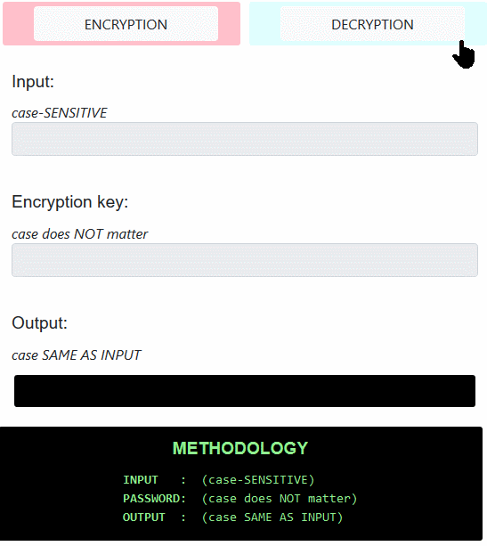

# Simple Vigenere Cipher
**A simple tool that encrypts and decrypts text using polyalphabetic substitution (Vigenere cipher) which is encryptable and decryptable independent from the technology available, even with pen and paper.**

**WARNING:** This is a casual tool and not tested thoroughly. Do **NOT** use it for important encryption purposes!

[Vigenere cipher](https://en.wikipedia.org/wiki/Vigen%C3%A8re_cipher) is a polyalphabetic substitution encrypting method that is also convenient to encrypt and decrypt manually. This means even if one loses access to the tools used during encryption, it is still possible to encrypt or decrypt the content using good old pen and paper, or by writing a simple program using any computer language.

## Usage
- The tool is available online [here](https://guneyozsan.github.io/simple-vigenere-cipher/).
- You can also download the source and run `index.html` on your browser. It is suggested to use an offline computer for security.

## Release
Latest version is available at [releases section](https://github.com/guneyozsan/simple-vigenere-cipher/releases).

For bugs, suggestions and feature requests please open an issue [here](https://github.com/guneyozsan/simple-vigenere-cipher/issues).

The command line prototype written in Python 3 is available [here](https://github.com/guneyozsan/simple-cold-wallet-encryptor-python-prototype) (Requires: Python 3).

## License
The project is open source and published under GNU General Public License version 3. More details can be found in the LICENSE.md file, in the source files or at <http://www.gnu.org/licenses>.

## Links
* **Author:**
saurabh Kumar, DSU, Bangalore
saurabh50197@gmail.com
* **Contact:**
